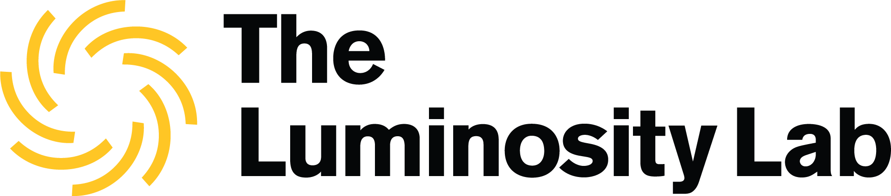

<div align="center">
  
</div>
<h3 align="center">The modern web app for The Luminosity Lab at Arizona State University.</h3>

<div align="center">

[](https://travis-ci.com/luminositylab/luminosity-frontend)

[](https://lbesson.mit-license.org/)

</div>

The Luminosity Lab website is a progressive web app created using Gatsby with React, featuring offline support using a service worker and advanced image optimization.
The site uses videos from [Pexels](https://www.pexels.com) and images from [Unsplash](https://unsplash.com). It is based upon [Forty by HTML5 Up](https://html5up.net/forty).

<!-- **cadams-io** is built on Gatsby/React using [Tailwind](https://tailwindcss.com/) and [Emotion](https://emotion.sh/) for styling, [React Spring](https://github.com/drcmda/react-spring) for the Parallax effect, has offline support, and is extremely cache-friendly. It is heavily based upon the [Gatsby Starter Portfolio: Cara](https://github.com/LeKoArts/gatsby-starter-portfolio-cara). -->

Feel free to use the code as you wish!

## Usage

This project uses Yarn for dependency management. To install dependencies and start, run:

```
yarn install
yarn start
```

This will start the server locally at http://localhost:8000.

### Building and Deploying

In order to compile the code, run:

```
yarn build
```

The `public` folder will contain the compiled code and assets.

To deploy, run:

```
yarn deploy
```

This will automatically build the code and then deploy to the `luminosity-lab` Firebase project and changes will be reflected at https://theluminositylab.com!

## License

The Luminosity web app code is open-sourced software licensed under the [MIT license](https://opensource.org/licenses/MIT).
